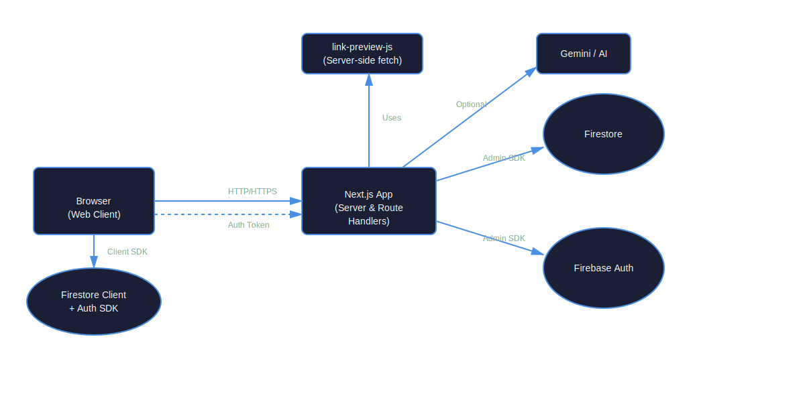
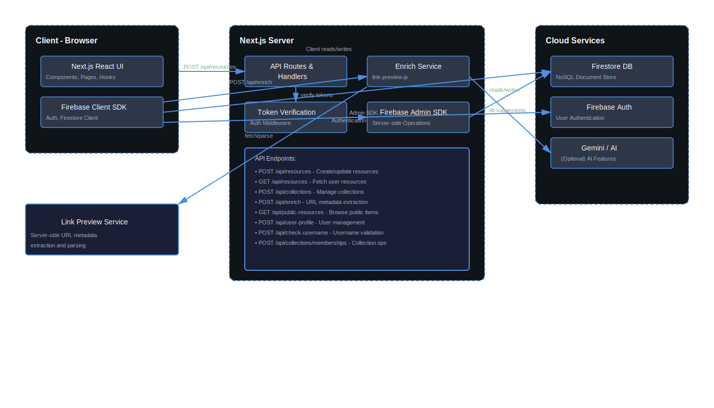
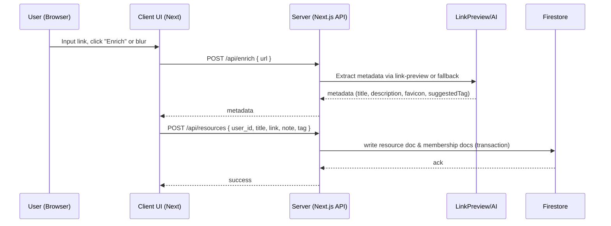
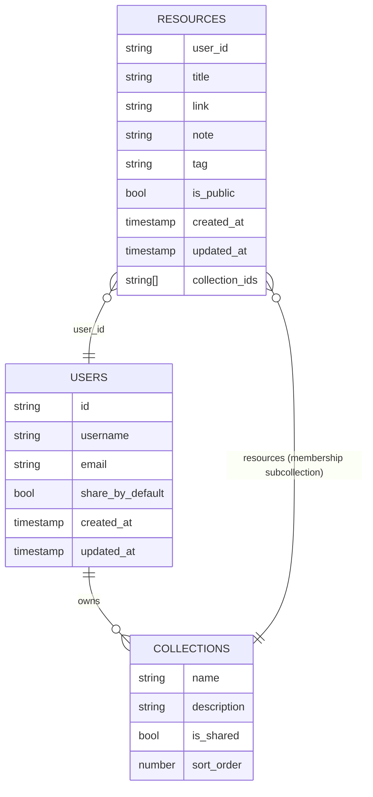

# System Design

## Overview
This document describes the high-level architecture of DumpIt:
- **Client** (Next.js React) - Web app
- **Server** (Next.js route handlers) - API endpoints, server-side rendering, route handlers
- **Firebase**: Firestore (data store), Firebase Auth
- **Optional external services**: Gemini AI, link preview service

## Components
- **Client**: UI components for Dashboard, AddResource, etc.
- **Server**: Next.js app routes under `app/api/` (collections, resources, enrich, users, etc.)
- **Database**: Firestore collections and subcollections

## Data Flows
- User creates resource on client → POST /api/resources → Server writes to Firestore
- Enrichment: client triggers POST /api/enrich → server uses `link-preview-js` or fallback parse
- Permissions: Client sends auth ID token (TODO: verify server-side)

---

## Architecture Diagrams

### 1. System Context (High Level)

This diagram shows the overall system architecture and how different components interact.



**Key Components:**
- **Browser (Web Client)**: User-facing Next.js React application
- **Next.js App**: Server-side application handling API routes and rendering
- **Firestore**: NoSQL database for storing resources, collections, and user data
- **Firebase Auth**: Authentication service
- **Gemini AI**: Optional AI service for intelligent features
- **Link Preview Service**: Server-side URL metadata extraction

<details>
<summary>📝 View Mermaid Source Code</summary>

```mermaid
flowchart LR
    Browser[Browser (Web client)] -->|HTTP/HTTPS| NextJs[Next.js App (Server & Route Handlers)]
    NextJs -->|Admin SDK| Firestore[(Firestore)]
    NextJs -->|Admin SDK| FirebaseAuth[(Firebase Auth)]
    NextJs -->|Optional| GeminiAPI[Gemini / AI]
    NextJs -->|Uses| LinkPreview[link-preview-js / Server-side fetch]
    Browser -->|Client SDK| FirestoreClient[(Firestore client + Auth SDK)]
    Browser -.->|Auth Token| NextJs
```

</details>

---

### 2. Container Diagram (Detailed Architecture)

This diagram provides a detailed view of the internal components within the client and server.



**Client Components:**
- **Next.js React UI**: User interface components
- **Firebase Client SDK**: Client-side Firebase integration

**Server Components:**
- **API Routes & Handlers**: RESTful API endpoints
- **Enrich Service**: URL metadata extraction and enrichment
- **Token Verification**: Authentication middleware
- **Firebase Admin SDK**: Server-side Firebase operations

**Cloud Services:**
- **Firestore DB**: Document database
- **Firebase Auth**: User authentication
- **Gemini AI**: Optional AI features

<details>
<summary>📝 View Mermaid Source Code</summary>

```mermaid
flowchart TB
    subgraph Client [Client - Browser]
        UI[Next.js React UI]
        SDK[Firebase Client SDK]
    end
    subgraph Server [Next.js Server]
        API[API Routes & Handlers]
        Enrich[Enrich Service]
        AuthVerification[Token verification / middleware]
        AdminSDK[Firebase Admin SDK]
    end
    subgraph Cloud[Cloud Services]
        Firestore[(Firestore DB)]
        FirebaseAuth[(Firebase Auth)]
        Gemini[Gemini / AI (Optional)]
    end

    UI -->|POST /api/resources| API
    UI -->|POST /api/enrich| Enrich
    API -->|Admin SDK reads/writes| AdminSDK
    AdminSDK --> Firestore
    Enrich -->|fetch/link-preview| LinkPreview[Link Preview Service]
    Enrich -->|AI suggestion| Gemini
    API -->|verify tokens| AuthVerification
    SDK -->|Client reads/writes| Firestore
```

</details>

---

### 3. Sequence Diagram: Create Resource with Enrichment

This sequence diagram illustrates the flow when a user creates a new resource with URL enrichment.


**Flow Steps:**
1. User inputs a link and triggers enrichment (click "Enrich" or blur event)
2. Client sends POST request to `/api/enrich` with the URL
3. Server extracts metadata using link-preview-js or fallback parser
4. Server returns metadata (title, description, favicon, suggested tag)
5. Client displays enriched data in the form
6. User submits the form, client sends POST to `/api/resources`
7. Server writes resource document and membership documents in a transaction
8. Server returns success response

<details>
<summary>📝 View Mermaid Source Code</summary>



</details>

---

### 4. Data Model (Firestore Collections)

This entity-relationship diagram shows the Firestore database structure.

> **Note:** For detailed field descriptions, see [`data-model.md`](./data-model.md)

**Collections:**
- **`resources`**: User-saved links and resources
- **`users`**: User profiles and settings
- **`users/{uid}/collections`**: User-created collections (subcollection)
- **`users/{uid}/collections/{collectionId}/resources`**: Collection membership (subcollection)

<details>
<summary>📊 View Entity-Relationship Diagram (Mermaid)</summary>



</details>

---

## Open Concerns & Future Improvements

### Security
- **Authentication/Authorization**: Ensure server verifies ID tokens before writing data
- Implement rate limiting for public endpoints (e.g., `/api/enrich`)
- Add CORS configuration for production

### Performance
- **Indexing**: Firestore query indices required for sorting and querying
  - Composite index on `resources` collection: `user_id` + `created_at`
  - Collection group index for shared collections
- Consider implementing caching for frequently accessed data
- Optimize bundle size for client-side application

### Scalability
- Monitor Firestore read/write operations
- Consider implementing pagination for large collections
- Evaluate CDN usage for static assets

---

## Related Documentation
- [API Specification](./api-spec.md) - Detailed API endpoint documentation
- [Data Model](./data-model.md) - Complete Firestore schema reference
- [Deployment Guide](./deployment.md) - Deployment and environment setup
- [Testing Guide](./testing.md) - Testing procedures and setup
