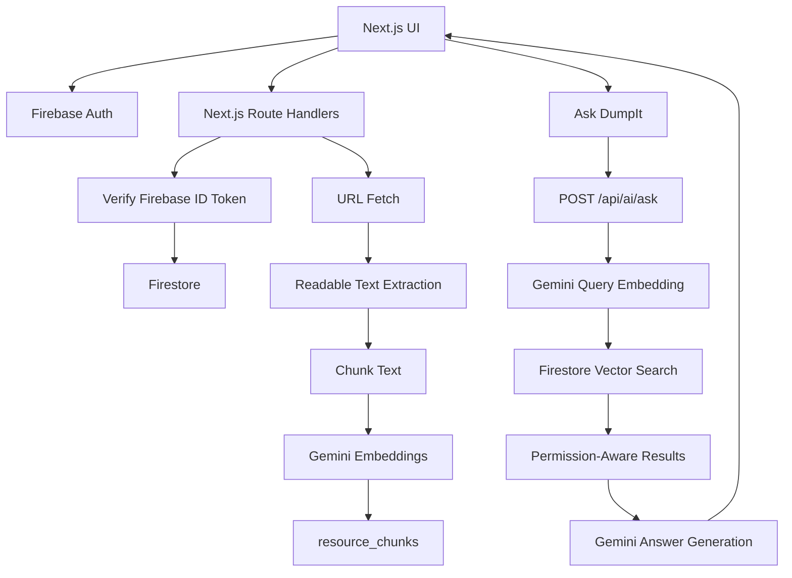

# System Design

## Overview

DumpIt is a Next.js AI knowledge workspace backed by Firebase.

Core services:

- Next.js App Router UI and route handlers.
- Firebase Auth for user identity.
- Firebase Admin SDK for server-side token verification and Firestore access.
- Firestore for resources, users, collections, and vectorized RAG chunks.
- Gemini for embeddings and answer generation.

## Current Architecture



## Resource Indexing Flow

Saving a URL creates the resource first, then attempts best-effort indexing.

1. Client sends `POST /api/resources` with a Firebase ID token.
2. Server verifies the token and derives `uid`.
3. Server writes the `resources` document.
4. Server fetches the saved URL.
5. Server extracts readable page text.
6. Server chunks the text.
7. Server embeds chunks with `GEMINI_EMBEDDING_MODEL`.
8. Server writes chunk documents to `resource_chunks`.
9. Server updates `resources.index_status`.

`index_status` is the main operational signal:

- `pending`: waiting or in progress
- `indexed`: searchable by Ask DumpIt
- `failed`: indexing threw an error
- `skipped`: no useful text or unsupported source

## Ask DumpIt Flow

1. Client sends `POST /api/ai/ask` with `{ question, mode, limit }`.
2. Server verifies the Firebase ID token.
3. Server embeds the question using Gemini.
4. Firestore vector search retrieves nearest chunks.
5. Server filters results by permission:
   - `mine`: chunks where `user_id == uid`
   - `shared`: chunks where `is_public == true` and `user_id != uid`
   - `all`: combines `mine` and `shared`
6. Server builds answer context from matching chunks.
7. Gemini generates a concise answer with citations.
8. API returns `{ answer, sources }`.

If no chunks match, the API returns a helpful no-context answer instead of fabricating.

## Firestore Vector Indexes

Firestore vector search requires explicit indexes for each filter shape.

`mine` requires:

```text
user_id ASC
embedding VECTOR 768
```

`shared` and the shared half of `all` require:

```text
is_public ASC
user_id ASC
embedding VECTOR 768
```

See [deployment.md](./deployment.md) for exact `gcloud` commands.

## Data Boundaries

- The client uses Firebase Auth and browser-safe `NEXT_PUBLIC_FIREBASE_*` config.
- Private resource reads/writes go through server routes with bearer tokens.
- Server routes derive ownership from verified Firebase ID tokens.
- Client-supplied owner IDs are not trusted.
- Gemini API keys and Firebase Admin credentials are server-only.

## Known Limitations

The v1 indexer is URL-fetch based. It may not index:

- private pages behind login
- pages that block server-side fetches
- heavily client-rendered pages
- PDFs or files that require special parsing
- videos without transcript extraction

Future extractors can add support for PDFs, YouTube transcripts, Google Docs exports, browser-captured pages, and manual text uploads.

## Related Documentation

- [API Specification](./api-spec.md)
- [Data Model](./data-model.md)
- [Deployment Guide](./deployment.md)
- [Testing Guide](./testing.md)
