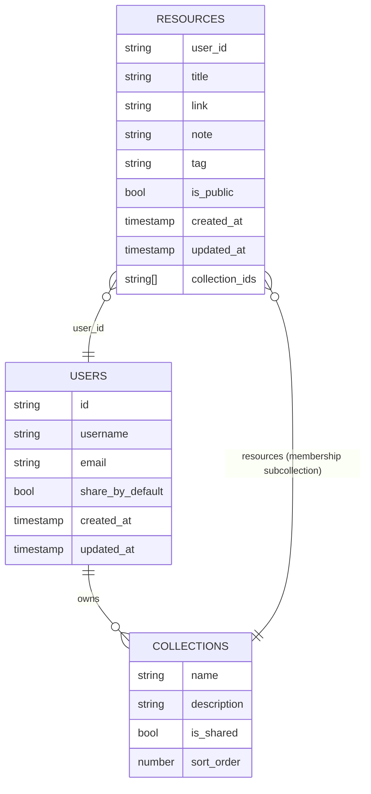

# System Design

## Overview
This document will describe the high-level architecture of DumpIt:
- Client (Next.js React) - Web app
- Server (Next.js route handlers) - API endpoints, server-side rendering, route handlers
- Firebase: Firestore (data store), Firebase Auth
- Optional external services: Gemini AI, link preview service

## Components
- Client: UI components for Dashboard, AddResource, etc.
- Server: Next.js app routes under `app/api/` (collections, resources, enrich, users, etc.)
- Database: Firestore collections and subcollections

## Data Flows
- User creates resource on client → POST /api/resources → Server writes to Firestore
- Enrichment: client triggers POST /api/enrich -> server uses `link-preview-js` or fallback parse
- Permissions: Client sends auth ID token (TODO: verify server-side)

## Diagrams

### System Context (High level)
Below is a rendered diagram (SVG) and the mermaid text (so it can be regenerated or edited easily). If your platform doesn't render Mermaid blocks, the SVG provides a visual fallback.


```html
<!-- Mermaid text for reference (and rendered if supported) -->
<pre>
flowchart LR
	Browser[Browser (Web client)] -->|HTTP/HTTPS| NextJs[Next.js App (Server & Route Handlers)]
	NextJs -->|Admin SDK| Firestore[(Firestore)]
	NextJs -->|Admin SDK| FirebaseAuth[(Firebase Auth)]
	NextJs -->|Optional| GeminiAPI[Gemini / AI]
	NextJs -->|Uses| LinkPreview[link-preview-js / Server-side fetch]
	Browser -->|Client SDK| FirestoreClient[(Firestore client + Auth SDK)]
	Browser -.->|Auth Token| NextJs
</pre>
``` 

### Container Diagram (Detailed)
Rendered diagram + Mermaid block below (SVG fallback included inline):


```html
flowchart TB
	subgraph Client [Client - Browser]
		UI[Next.js React UI]
		SDK[Firebase Client SDK]
	end
	subgraph Server [Next.js Server]
		API[API Routes & Handlers]
		Enrich[Enrich Service]
		AuthVerification[Token verification / middleware]
		AdminSDK[Firebase Admin SDK]
	end
	subgraph Cloud[Cloud Services]
		Firestore[(Firestore DB)]
		FirebaseAuth[(Firebase Auth)]
		Gemini[Gemini / AI (Optional)]
	end

	UI -->|POST /api/resources| API
	UI -->|POST /api/enrich| Enrich
	API -->|Admin SDK reads/writes| AdminSDK
	AdminSDK --> Firestore
	Enrich -->|fetch/link-preview| LinkPreview
	Enrich -->|AI suggestion| Gemini
	API -->|verify tokens| AuthVerification
	SDK -->|Client reads/writes| Firestore
```

### Sequence: Create resource with enrichment
Rendered diagram + Mermaid block below (SVG fallback included inline):


```html
sequenceDiagram
	participant U as User (Browser)
	participant C as Client UI (Next)
	participant S as Server (Next.js API)
	participant L as LinkPreview/AI
	participant DB as Firestore

	U->>C: Input link, click "Enrich" or blur
	C->>S: POST /api/enrich { url }
	S->>L: Extract metadata via link-preview or fallback
	L-->>S: metadata (title, description, favicon, suggestedTag)
	S-->>C: metadata
	C->>S: POST /api/resources { user_id, title, link, note, tag }
	S->>DB: write resource doc & membership docs (transaction)
	DB-->>S: ack
	S-->>C: success
```

### Data Model (Firestore Collections)
Rendered ER diagram + Mermaid block below (SVG fallback included inline):




## Open Concerns
- Authentication/Authorization: Ensure server verifies ID tokens before writing data
- Indexing: Firestore query indices required for sorting and querying

